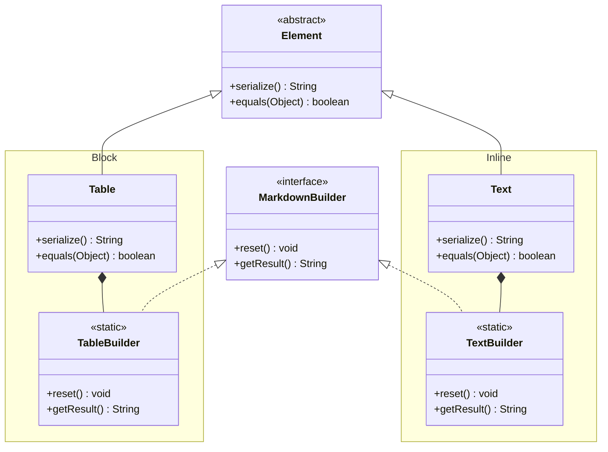

## Объектная модель:

Базовый Builder Паттерн, от которого мы будем отталкиваться:

В дополнение к данной модели реализуем Director класс, который:
1. Инкапсулирует сложную логику построения элементов markdown
2. Предоставляет готовые методы для создания типовых конструкций (простые таблицы, форматированный текст)
3. Использует builders через их методы для пошаговой сборки элементов
4. Позволяет переиспользовать одинаковые последовательности построения в разных местах программы