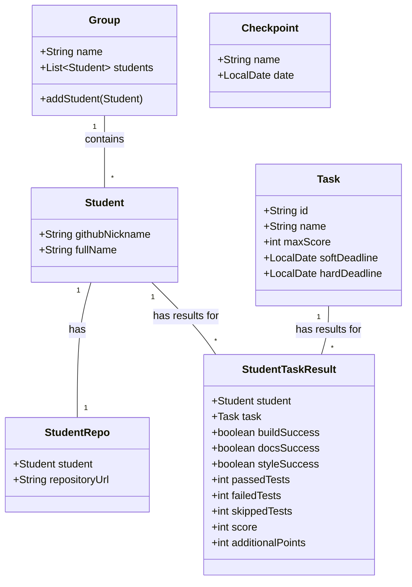

# OOP Task Checker

```mermaid
classDiagram
    class Task {
        +String id
        +String name
        +int maxScore
        +LocalDate softDeadline
        +LocalDate hardDeadline
    }

    class Student {
        +String githubNickname
        +String fullName
    }

    class Group {
        +String name
        +List~Student~ students
        +addStudent(Student)
    }

    class Checkpoint {
        +String name
        +LocalDate date
    }

    class StudentRepo {
        +Student student
        +String repositoryUrl
    }

    class StudentTaskResult {
        +Student student
        +Task task
        +boolean buildSuccess
        +boolean docsSuccess
        +boolean styleSuccess
        +int passedTests
        +int failedTests
        +int skippedTests
        +int score
        +int additionalPoints
    }

    Group "1" -- "*" Student : contains
    Student "1" -- "1" StudentRepo : has
    Student "1" -- "*" StudentTaskResult : has results for
    Task "1" -- "*" StudentTaskResult : has results for
```